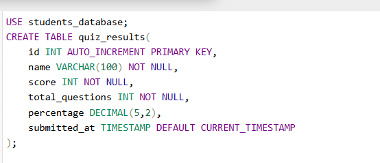
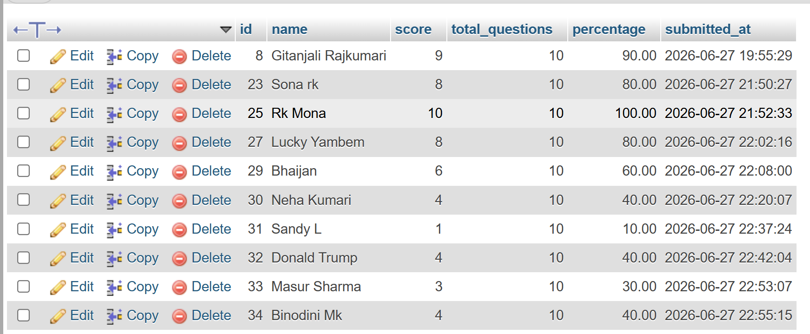
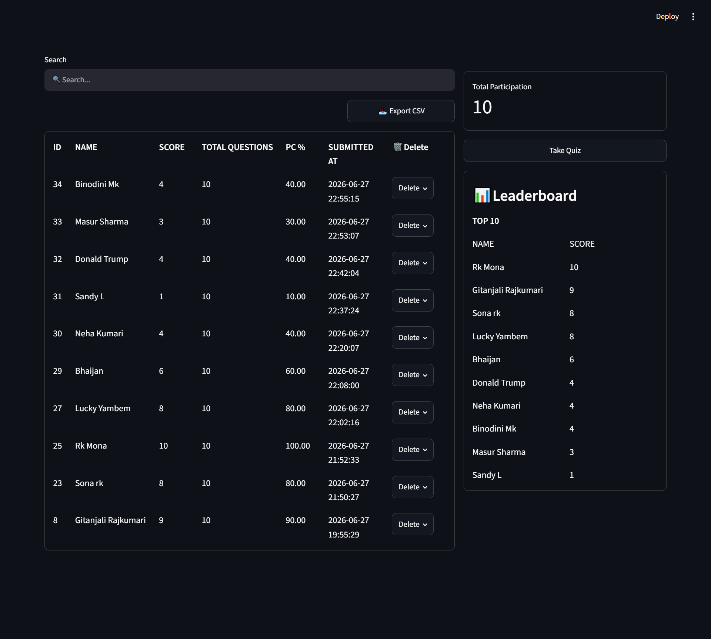
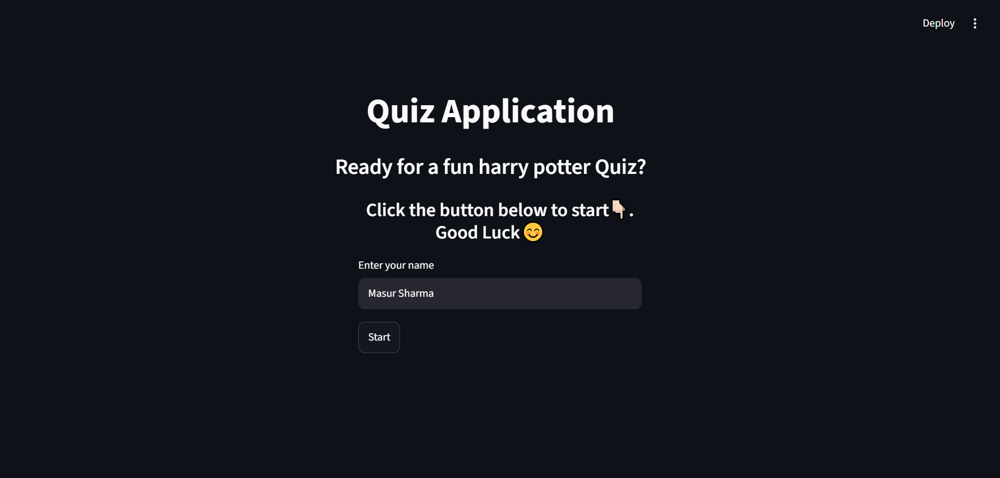
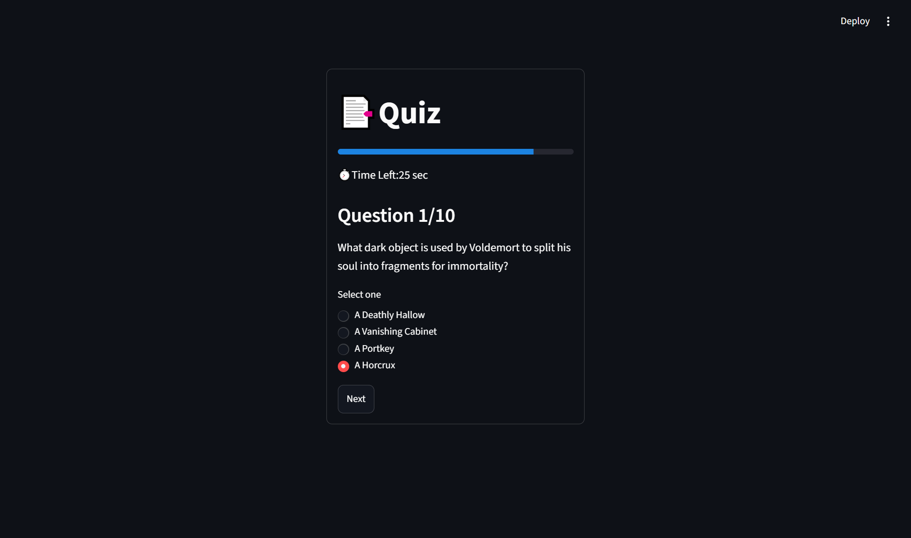
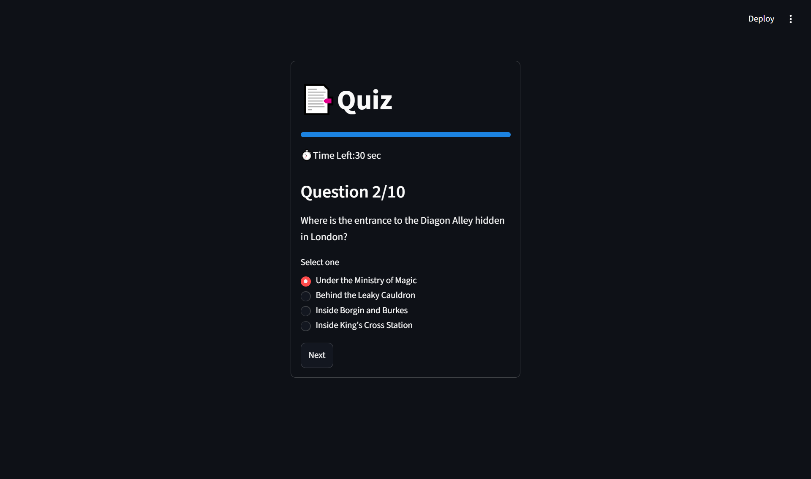
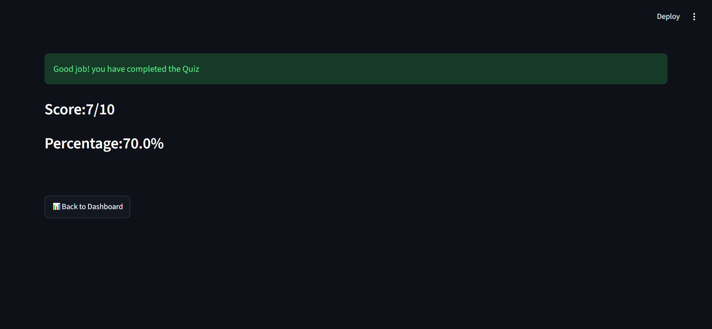
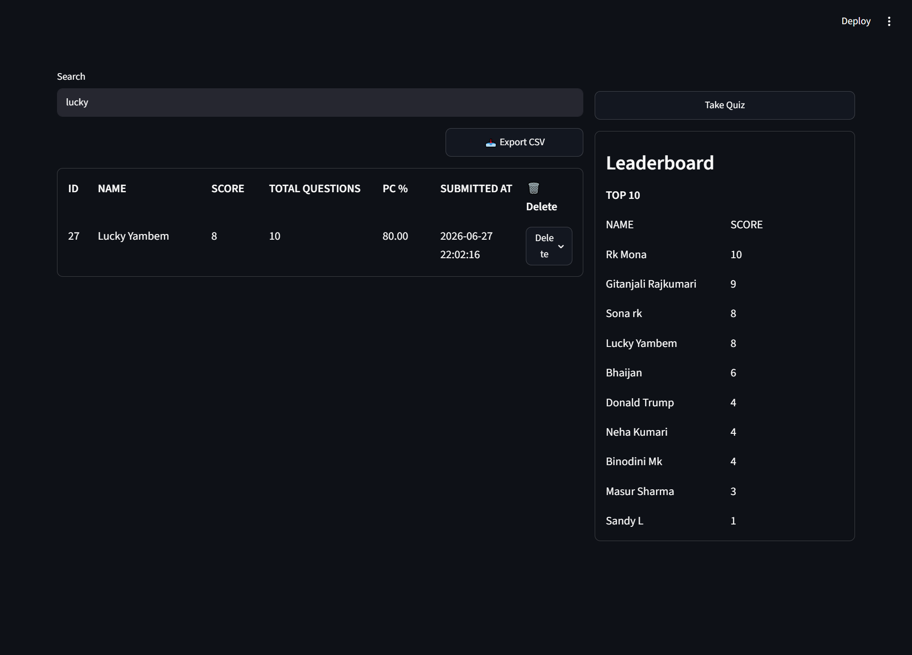
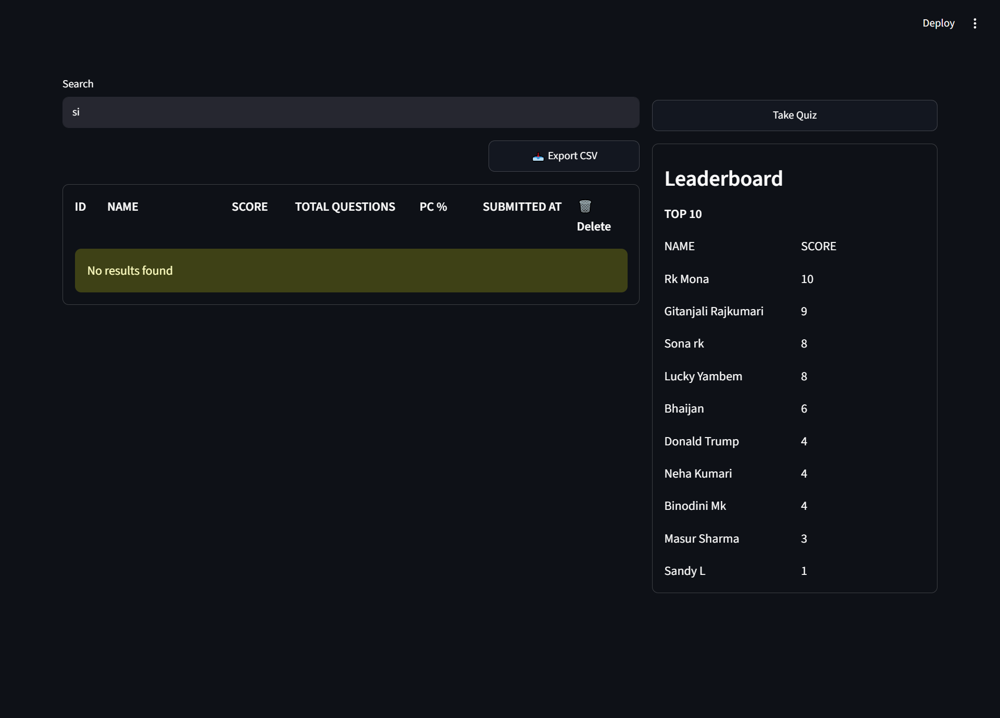
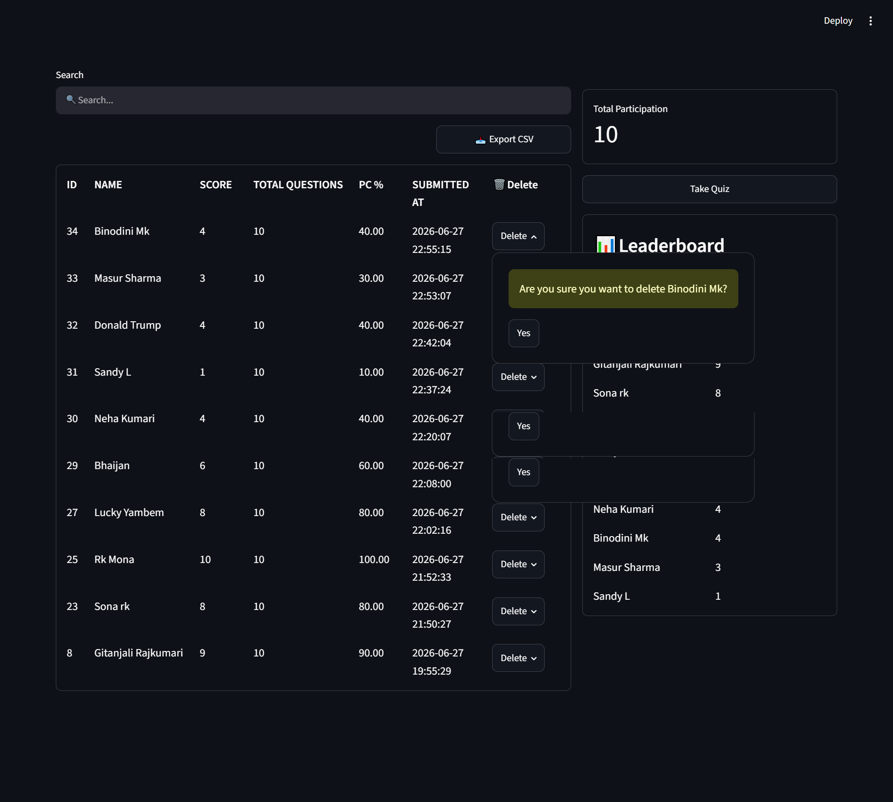

# Quiz Application 
a simple Quiz Application built using Python, Streamlit, and MySQL. Users can take a timed multiple-choice quiz, view their score and percentage, and have their results stored in a MySQL database. The application also provides a dashboard for viewing previous quiz attempts, searching results, exporting data to CSV, and displaying a leaderboard.
## Installation
```
pip install -r requirements.txt
```
## Database Setup
- Install [XAMPP](https://www.apachefriends.org/)acoording to your os.
- Make sure MySQL and Apache server is up and ruuning in the XAMPP control panel.
- Next, open [PHP MY ADMIN](http://localhost/phpmyadmin/) and go to SQL to run the following commands:

- Next, you can proceed to run the app.
## Running the Project
```
streamlit run main.py
```
## Database Screenshot

## Project Screenshot
### [DashBoard](app.py)

### [Start Page](quiz.py)




### [Search](app.py)


### Delete

### A sample of the [CSV](./images/quiz_results.csv) file.