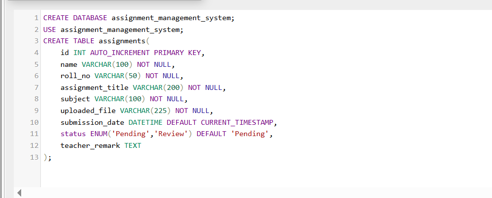
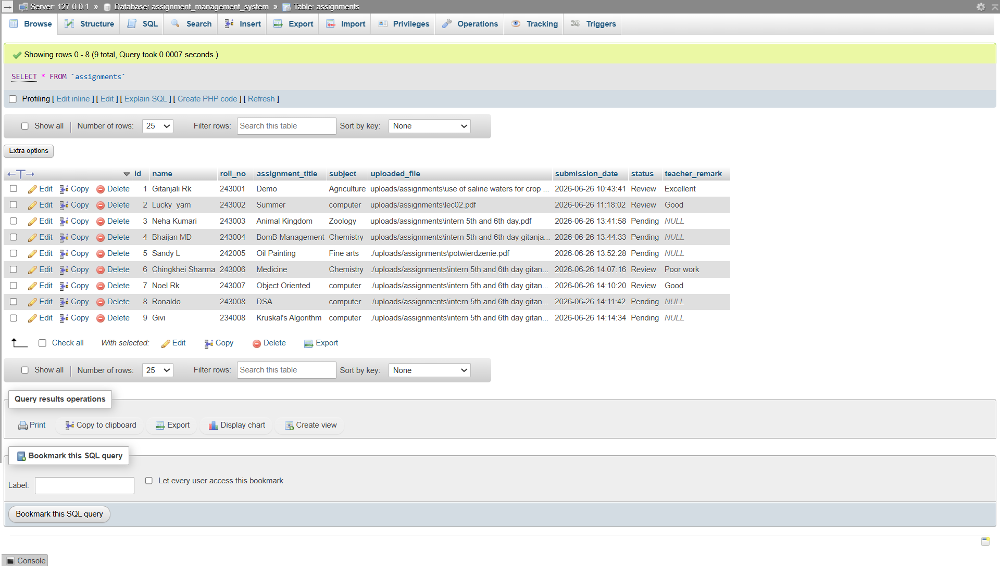
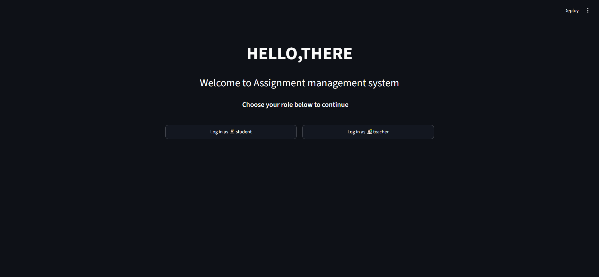
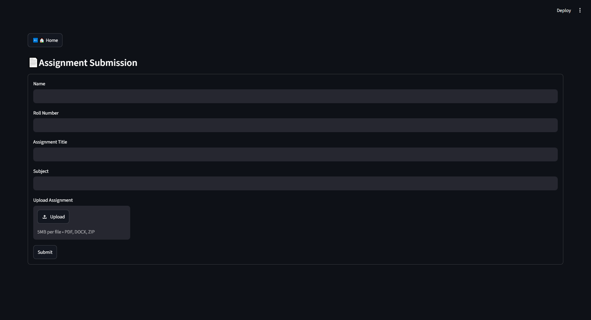
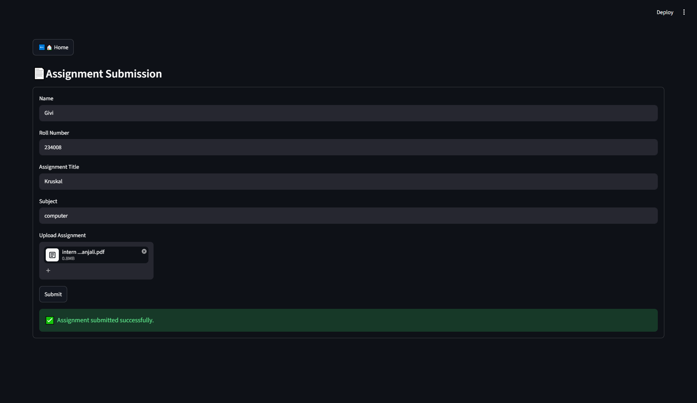
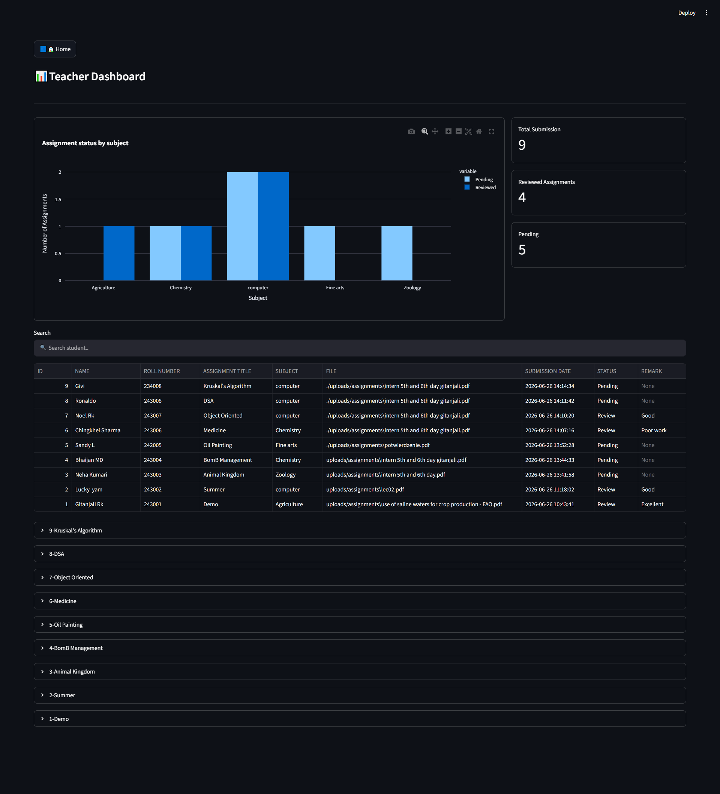
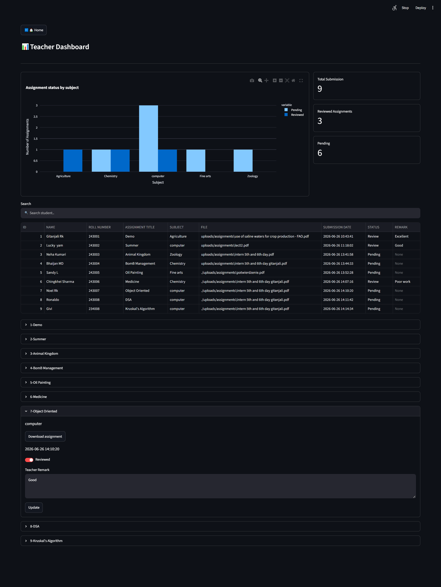
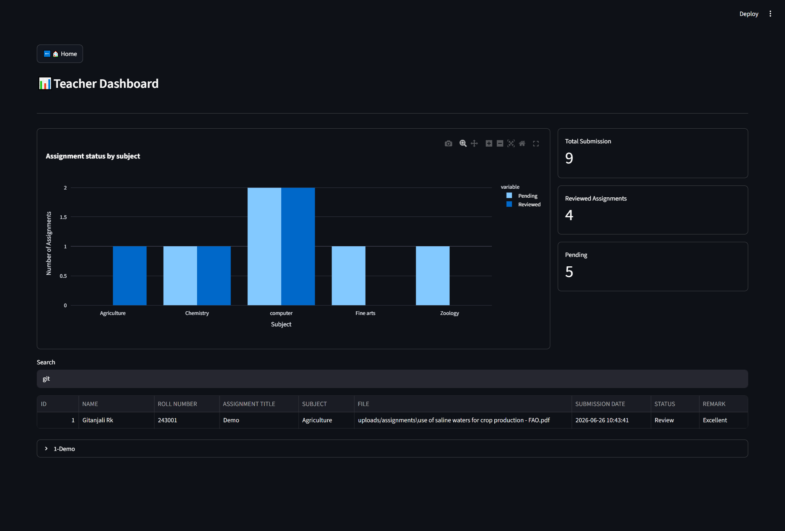

# Assignment Management System
A simple Assignment Management System built using Python, Streamlit, and MySQL. It allows students to submit assignments online and enables teachers to review, manage, and provide feedback through an interactive dashboard.
## Installation
```
pip install -r requirements.txt
```
## Database Setup
- Install [XAMPP](https://www.apachefriends.org/)acoording to your os.
- Make sure MySQL and Apache server is up and ruuning in the XAMPP control panel.
- Next, open [PHP MY ADMIN](http://localhost/phpmyadmin/) and go to SQL to run the following commands:

- Next, you can proceed to run the app.
## Running the Project
```
streamlit run main.py
```
## Database Screenshot

## Project Screenshot
### [Log in Page](main.py)

### [Student Page](student.py)


### [Teacher Page](teacher.py)


